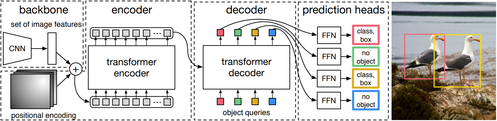
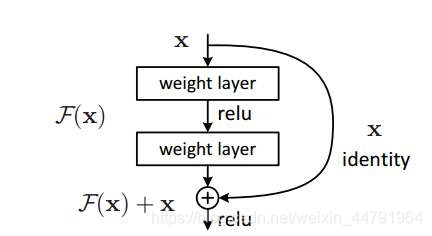
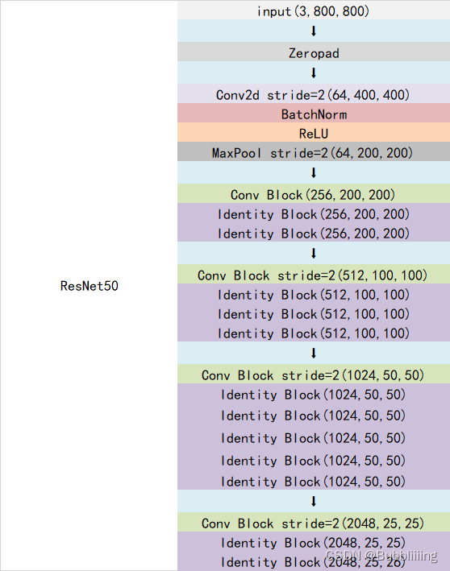
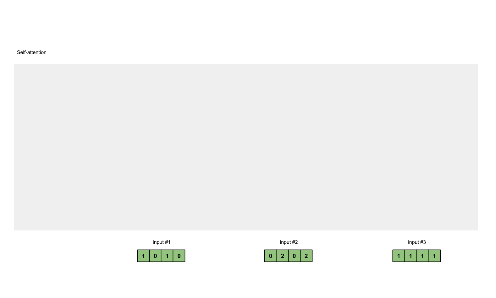
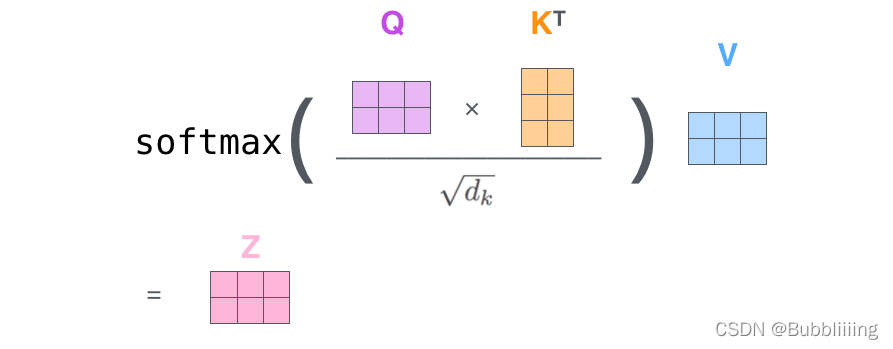
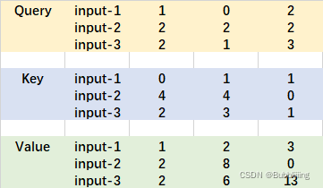
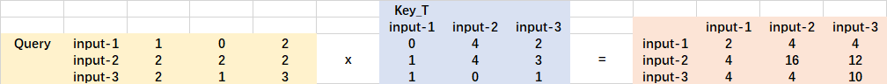
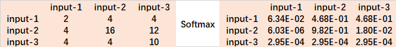
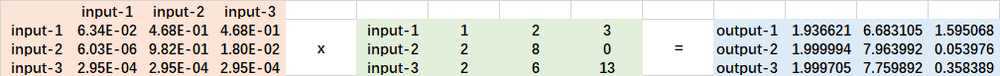
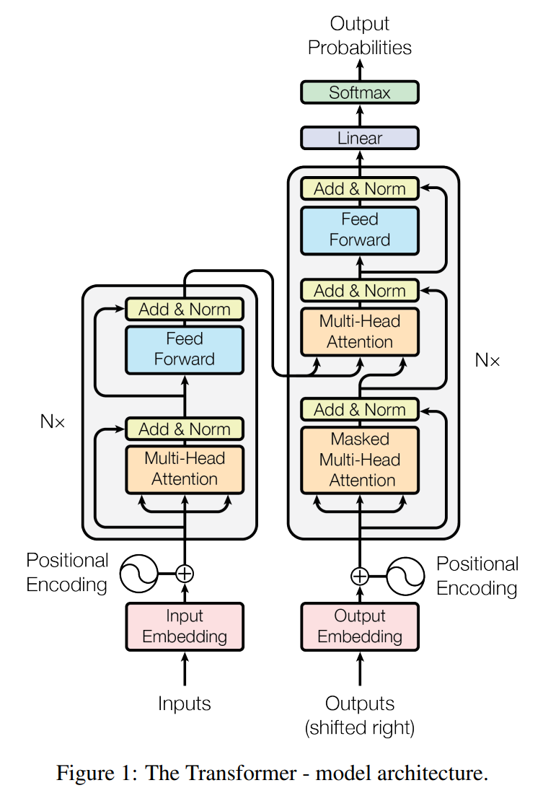

[睿智的目标检测65——Pytorch搭建DETR目标检测平台_Bubbliiiing的博客-CSDN博客](https://blog.csdn.net/weixin_44791964/article/details/128361674)

# 源码下载

https://github.com/bubbliiiing/[detr](https://so.csdn.net/so/search?q=detr&spm=1001.2101.3001.7020)-pytorch
喜欢的可以点个star噢。

# DETR实现思路

## 一、整体结构解析



在学习DETR之前，我们需要对DETR所做的工作有一定的了解，这有助于我们后面去了解网络的细节。上面这幅图是论文里的Fig. 2，比较好的展示了整个DETR的工作原理。整个DETR可以分为四个部分，分别是：**backbone、encoder、decoder以及prediction heads**。

**backbone是DETR的主干特征提取网络**，输入的图片首先会在主干网络里面进行**特征提取**，提取到的特征可以被称作特征层，**是输入图片的特征集合**。在主干部分，我们**获取了一个特征层**进行下一步网络的构建，这一个特征层我称它为**有效特征层**。

**encoder是Transformer的编码网络-特征加强**，在主干部分获得的一个**有效特征层**会首先在高宽维度进行平铺，成为一个特征序列，然后会在这一部分继续使用Self-Attension进行加强特征提取，获得一个**加强后的有效特征层**。它属于Transformer的编码网络，编码的下一步是解码。

**decoder是Transformer的解码网络-特征查询**，在encoder部分获得的一个**加强后的有效特征层**会在这一部分进行解码，解码需要使用到一个非常重要的可学习模块，即上图呈现的object queries。在decoder部分，我们使用一个**可学习的查询向量q**对**加强后的有效特征层**进行查询，获得预测结果。

**prediction heads是DETR的分类器与回归器**，其实就是对decoder获得的预测结果进行全连接，两次全连接分别代表种类和回归参数。图上画了4个FFN，源码中是2个FFN。

因此，整个DETR网络所作的工作就是 **特征提取-特征加强-特征查询-预测结果**。

## 二、网络结构解析

### 1、主干网络Backbone介绍


DETR可以采用多种的主干特征提取网络，论文中用的是Resnet，本文以Resnet50网络为例子来给大家演示一下。

#### a、什么是残差网络

Residual net(残差网络)：

**将靠前若干层的某一层数据**输出直接**跳过多层**引入到**后面数据层的输入部分。**意味着**后面的特征层的内容会有一部分由其前面的某一层线性贡献。**

其结构如下：



深度残差网络的设计是为了克服由于网络深度加深而产生的学习效率变低与准确率无法有效提升的问题。

#### b、什么是ResNet50模型

ResNet50有两个基本的块，**分别名为Conv Block和Identity Block，其中Conv Block输入和输出的维度是不一样的，所以不能连续串联，它的作用是改变网络的维度；Identity Block输入维度和输出维度相同，可以串联，它的作用是加深网络的。**

Conv Block的结构如下，由图可以看出，Conv Block可以分为两个部分，**左边部分为主干部分，存在两次卷积、标准化、激活函数和一次卷积、标准化；右边部分为残差边部分，存在一次卷积、标准化**，由于残差边部分存在卷积，所以我们可以利用Conv Block改变输出特征层的宽高和通道数：


Identity Block的结构如下，由图可以看出，Identity Block可以分为两个部分，**左边部分为主干部分，存在两次卷积、标准化、激活函数和一次卷积、标准化；右边部分为残差边部分，直接与输出相接**，由于残差边部分不存在卷积，所以Identity Block的输入特征层和输出特征层的shape是相同的，可用于加深网络：


Conv Block和Identity Block都是残差网络结构。

总的网络结构如下：



在DETR中，假设输入为[batch_size, 3, 800, 800]，此时输出为[batch_size, 2048, 25, 25]，代码直接使用了torchvision库中自带的resnet，因此整个主干实现代码为：

```python
class FrozenBatchNorm2d(torch.nn.Module):
    """
    冻结固定的BatchNorm2d。
    """
    def __init__(self, n):
        super(FrozenBatchNorm2d, self).__init__()
        self.register_buffer("weight", torch.ones(n))
        self.register_buffer("bias", torch.zeros(n))
        self.register_buffer("running_mean", torch.zeros(n))
        self.register_buffer("running_var", torch.ones(n))

    def _load_from_state_dict(self, state_dict, prefix, local_metadata, strict, missing_keys, unexpected_keys, error_msgs):
        num_batches_tracked_key = prefix + 'num_batches_tracked'
        if num_batches_tracked_key in state_dict:
            del state_dict[num_batches_tracked_key]

        super(FrozenBatchNorm2d, self)._load_from_state_dict(
            state_dict, prefix, local_metadata, strict,
            missing_keys, unexpected_keys, error_msgs)

    def forward(self, x):
        w       = self.weight.reshape(1, -1, 1, 1)
        b       = self.bias.reshape(1, -1, 1, 1)
        rv      = self.running_var.reshape(1, -1, 1, 1)
        rm      = self.running_mean.reshape(1, -1, 1, 1)
        eps     = 1e-5
        scale   = w * (rv + eps).rsqrt()
        bias    = b - rm * scale
        return x * scale + bias

class BackboneBase(nn.Module):
    """
    用于指定返回哪个层的输出
    这里返回的是最后一层
    """
    def __init__(self, backbone: nn.Module, train_backbone: bool, num_channels: int, return_interm_layers: bool):
        super().__init__()
        for name, parameter in backbone.named_parameters():
            if not train_backbone or 'layer2' not in name and 'layer3' not in name and 'layer4' not in name:
                parameter.requires_grad_(False)
        if return_interm_layers:
            return_layers   = {"layer1": "0", "layer2": "1", "layer3": "2", "layer4": "3"}
        else:
            return_layers   = {'layer4': "0"}
            
        # 用于指定返回的层
        self.body           = IntermediateLayerGetter(backbone, return_layers=return_layers)
        self.num_channels   = num_channels

    def forward(self, tensor_list: NestedTensor):
        xs                           = self.body(tensor_list.tensors)
        out: Dict[str, NestedTensor] = {}
        for name, x in xs.items():
            m           = tensor_list.mask
            assert m is not None
            mask        = F.interpolate(m[None].float(), size=x.shape[-2:]).to(torch.bool)[0]
            out[name]   = NestedTensor(x, mask)
        return out

class Backbone(BackboneBase):
    """
    ResNet backbone with frozen BatchNorm.
    """
    def __init__(self, name: str, train_backbone: bool, return_interm_layers: bool,dilation: bool):
        # 首先利用torchvision里面的model创建一个backbone模型
        backbone = getattr(torchvision.models, name)(
            replace_stride_with_dilation    = [False, False, dilation],
            pretrained                      = is_main_process(), 
            norm_layer                      = FrozenBatchNorm2d
        )
        # 根据选择的模型，获得通道数
        num_channels = 512 if name in ('resnet18', 'resnet34') else 2048
        super().__init__(backbone, train_backbone, num_channels, return_interm_layers)
```

#### c、位置编码


除去利用主干进行特征提取外，因为要传入Transformer进行特征提取与特征查询，主干获得的特征还需要进行位置编码。在图片上不属于backbone，但是在backbone.py里实现的，所以一起简单解析一下。

其实就是原Transformer的position embedding的思想，**为所有特征添加上位置信息**，**这样网络才有区分不同区域的能力**。

DETR是为resnet输出的特征图在pos_x和pos_y方向各自计算了一个位置编码，每个维度的位置编码长度为num_pos_feats，默认为Transformer的特征长度的一半，为128。对pos_x和pos_y，在奇数位置计算正弦，在偶数位置计算余弦，然后将计算结果进行拼接。得到一个[batch_size, h, w, 256]的向量。最后进行转置，获得[batch_size, 256, h, w]的向量。

代码如下：

```python
class PositionEmbeddingSine(nn.Module):
    """
    这是一个更标准的位置嵌入版本，按照sine进行分布
    """
    def __init__(self, num_pos_feats=64, temperature=10000, normalize=False, scale=None):
        super().__init__()
        self.num_pos_feats  = num_pos_feats
        self.temperature    = temperature
        self.normalize      = normalize
        if scale is not None and normalize is False:
            raise ValueError("normalize should be True if scale is passed")
        if scale is None:
            scale = 2 * math.pi
        self.scale = scale

    def forward(self, tensor_list: NestedTensor):
        x           = tensor_list.tensors   # [B, 2048, 25, 25]
        mask        = tensor_list.mask      # [B, 25, 25]
        assert mask is not None
        not_mask    = ~mask
        y_embed     = not_mask.cumsum(1, dtype=torch.float32)   # [B, 25, 25]
        x_embed     = not_mask.cumsum(2, dtype=torch.float32)   # [B, 25, 25]
        if self.normalize:
            eps     = 1e-6
            y_embed = y_embed / (y_embed[:, -1:, :] + eps) * self.scale # [B, 25, 25] / [B, 1, 25]
            x_embed = x_embed / (x_embed[:, :, -1:] + eps) * self.scale # [B, 25, 25] / [B, 25, 1]

        dim_t = torch.arange(self.num_pos_feats, dtype=torch.float32, device=x.device)  # [128] [0., 1., 2., 3., 4. ...]
        dim_t = self.temperature ** (2 * (dim_t // 2) / self.num_pos_feats)

        pos_x = x_embed[:, :, :, None] / dim_t  # [B, 25, 25] => [B, 25, 25, 1] => [B, 25, 25, 128]
        pos_y = y_embed[:, :, :, None] / dim_t  # [B, 25, 25] => [B, 25, 25, 1] => [B, 25, 25, 128]
        pos_x = torch.stack((pos_x[:, :, :, 0::2].sin(), pos_x[:, :, :, 1::2].cos()), dim=4).flatten(3) # [B, 25, 25, 64] stack [B, 25, 25, 64] => [B, 25, 25, 64, 2] => [B, 25, 25, 128]
        pos_y = torch.stack((pos_y[:, :, :, 0::2].sin(), pos_y[:, :, :, 1::2].cos()), dim=4).flatten(3) # [B, 25, 25, 64] stack [B, 25, 25, 64] => [B, 25, 25, 64, 2] => [B, 25, 25, 128]
        pos = torch.cat((pos_y, pos_x), dim=3).permute(0, 3, 1, 2)  # [B, 25, 25, 128] cat [B, 25, 25, 128] => [B, 25, 25, 256] => [B, 256, 25, 25]
        return pos
```

### 2、编码网络Encoder网络介绍


#### a、Transformer Encoder的构建

在上文中，我们获得了两个矩阵，一个矩阵是输入图片的特征矩阵，一个是特征矩阵对应的位置编码。它们的shape分别为[batch_size, 2048, 25, 25]、[batch_size, 256, 25, 25]。

在编码网络部分，DETR使用Transformer的Encoder部分进行特征提取。我们需要首先对特征矩阵进行通道的缩放，如果直接对特征矩阵进行transformer的特征提取的话，由于网络的通道数太大（2048），会直接导致显存不足。利用一个1x1的nn.Conv2d进行通道的压缩，压缩后的通道为256，即Transformer用到的特征长度。此时我们获得了一个shape为[batch_size, 256, 25, 25]的特征矩阵。

然后我们对特征矩阵与位置编码的高宽维度进行平铺获得两个shape为[batch_size, 256, 625]的矩阵，由于我们使用的是Pytorch自带的nn.MultiheadAttention，该模块要求batch_size位于第1维，序列长度位于第0维，所以我们将特征矩阵与位置编码进行转置，转置后的两个矩阵为[625, batch_size, 256]。

我们此时可以将其输入到Encoder当中进行特征提取。Encoder并不会改变输入的shape，因此经过Encoder进行特征提取的**加强后的特征序列**shape也为[625, batch_size, 256]。

由于在DETR中，Transformer的Encoder直接使用了Pytorch的MultiheadAttention，我们不必太贵纠结原理，简单了解一下就可以，在DETR中，整个Transformer Encoder的实现代码为：

```python
class TransformerEncoder(nn.Module):
    def __init__(self, encoder_layer, num_layers, norm=None):
        super().__init__()
        self.layers = _get_clones(encoder_layer, num_layers)
        self.num_layers = num_layers
        self.norm = norm

    def forward(self, src,
                mask: Optional[Tensor] = None,
                src_key_padding_mask: Optional[Tensor] = None,
                pos: Optional[Tensor] = None):
        output = src
        # [625, B, 256] => ...(x6)... => [625, B, 256]
        for layer in self.layers:
            output = layer(output, src_mask=mask, src_key_padding_mask=src_key_padding_mask, pos=pos)

        if self.norm is not None:
            output = self.norm(output)
        return output

class TransformerEncoderLayer(nn.Module):
    def __init__(self, d_model, nhead, dim_feedforward=2048, dropout=0.1,
                 activation="relu", normalize_before=False):
        super().__init__()
        # Self-Attention模块
        self.self_attn  = nn.MultiheadAttention(d_model, nhead, dropout=dropout)
        # FFN模块
        # Implementation of Feedforward model
        self.linear1    = nn.Linear(d_model, dim_feedforward)
        self.dropout    = nn.Dropout(dropout)
        self.linear2    = nn.Linear(dim_feedforward, d_model)

        self.norm1      = nn.LayerNorm(d_model)
        self.norm2      = nn.LayerNorm(d_model)
        self.dropout1   = nn.Dropout(dropout)
        self.dropout2   = nn.Dropout(dropout)

        self.activation = _get_activation_fn(activation)
        self.normalize_before = normalize_before

    def with_pos_embed(self, tensor, pos: Optional[Tensor]):
        return tensor if pos is None else tensor + pos

    def forward_post(self,
                     src,
                     src_mask: Optional[Tensor] = None,
                     src_key_padding_mask: Optional[Tensor] = None,
                     pos: Optional[Tensor] = None):
        # 添加位置信息
        # [625, B, 256] + [625, B, 256] => [625, B, 256]
        q = k = self.with_pos_embed(src, pos)
        # 使用自注意力机制模块
        # [625, B, 256] => [625, B, 256]
        src2 = self.self_attn(q, k, value=src, attn_mask=src_mask, key_padding_mask=src_key_padding_mask)[0]
        # 添加残差结构
        # [625, B, 256] => [625, B, 256]
        src = src + self.dropout1(src2)

        # 添加FFN结构
        # [625, B, 256] => [625, B, 2048] => [625, B, 256]
        src = self.norm1(src)
        src2 = self.linear2(self.dropout(self.activation(self.linear1(src))))
        # 添加残差结构
        # [625, B, 256] => [625, B, 256]
        src = src + self.dropout2(src2)
        src = self.norm2(src)
        return src

    def forward_pre(self, src,
                    src_mask: Optional[Tensor] = None,
                    src_key_padding_mask: Optional[Tensor] = None,
                    pos: Optional[Tensor] = None):
        src2 = self.norm1(src)
        q = k = self.with_pos_embed(src2, pos)
        src2 = self.self_attn(q, k, value=src2, attn_mask=src_mask,
                              key_padding_mask=src_key_padding_mask)[0]
        src = src + self.dropout1(src2)
        src2 = self.norm2(src)
        src2 = self.linear2(self.dropout(self.activation(self.linear1(src2))))
        src = src + self.dropout2(src2)
        return src

    def forward(self, src,
                src_mask: Optional[Tensor] = None,
                src_key_padding_mask: Optional[Tensor] = None,
                pos: Optional[Tensor] = None):
        if self.normalize_before:
            return self.forward_pre(src, src_mask, src_key_padding_mask, pos)
        return self.forward_post(src, src_mask, src_key_padding_mask, pos)
```

#### b、Self-attention结构解析

在这里可以简单了解一下多头注意力机制的原理，多头注意力机制的计算原理如下：

看懂Self-attention结构，其实看懂下面这个动图就可以了，动图中存在**一个序列的三个单位输入**，**每一个序列单位的输入**都可以通过**三个处理（比如全连接）获得Query、Key、Value**，Query是查询向量、Key是键向量、Value值向量。



如果我们想要获得input-1的输出，那么我们进行如下几步：

1. 利用**input-1的查询向量**，分别乘上**input-1、input-2、input-3的键向量**，此时我们获得了**三个score**。
2. 然后对**这三个score取softmax**，获得了**input-1、input-2、input-3**各自的重要程度0。
3. 然后将这个重要程度乘上**input-1、input-2、input-3**的值向量，求和。
4. 此时我们获得了input-1的输出。

如图所示，我们进行如下几步：

1. **input-1的查询向量为[1, 0, 2]**，分别乘上**input-1、input-2、input-3的键向量**，获得三个score为2，4，4。

2. 然后对**这三个score取softmax**，获得了**input-1、input-2、input-3**各自的重要程度，获得三个重要程度为0.0，0.5，0.5。

3. 然后将这个重要程度乘上**input-1、input-2、input-3**的值向量，求和，即

   $0.0∗[1,2,3]+0.5∗[2,8,0]+0.5∗[2,6,3]=[2.0,7.0,1.5]$

4. 此时我们获得了input-1的输出 [2.0, 7.0, 1.5]。

上述的例子中，**序列长度仅为3，每个单位序列的特征长度仅为3**，在DETR的Transformer Encoder中，**序列长度为625，每个单位序列的特征长度为256 // num_heads**。但计算过程是一样的。在实际运算时，**我们采用矩阵进行运算。**

实际的矩阵运算过程如下图所示。我以实际矩阵为例子给大家解析：



输入的Query、Key、Value如下图所示：



首先利用 **查询向量query** 叉乘 **转置后的键向量key**，这一步可以通俗的理解为，**利用查询向量去查询序列的特征，获得序列每个部分的重要程度score。**

**输出的每一行，都代表input-1、input-2、input-3，对当前input的贡献**，我们对这个贡献值取一个softmax。





然后利用 score 叉乘 value，**这一步可以通俗的理解为，将序列每个部分的重要程度重新施加到序列的值上去。**



这个矩阵运算的代码如下所示，各位同学可以自己试试。

```python
import numpy as np

def soft_max(z):
    t = np.exp(z)
    a = np.exp(z) / np.expand_dims(np.sum(t, axis=1), 1)
    return a

Query = np.array([
    [1,0,2],
    [2,2,2],
    [2,1,3]
])

Key = np.array([
    [0,1,1],
    [4,4,0],
    [2,3,1]
])

Value = np.array([
    [1,2,3],
    [2,8,0],
    [2,6,3]
])

scores = Query @ Key.T
print(scores)
# [[ 2  4  4]
#  [ 4 16 12]
#  [ 4 12 10]]

scores = soft_max(scores)
print(scores)
# [[6.33789383e-02 4.68310531e-01 4.68310531e-01]
#  [6.03366485e-06 9.82007865e-01 1.79861014e-02]
#  [2.95387223e-04 8.80536902e-01 1.19167711e-01]]

out = scores @ Value
print(out)
# [[1.93662106 6.68310531 1.59506841]
#  [1.99999397 7.9639916  0.05397641]
#  [1.99970461 7.75989225 0.35838929]
```

### 3、解码网络Decoder网络介绍


通过上述第二步，我们可以获得一个利用Encoder加强特征提取后的特征矩阵，它的shape为[625, batch_size, 256]。

在encoder部分获得的一个**加强后的有效特征层**会在这一部分进行解码，解码需要使用到一个非常重要的可学习模块，即上图呈现的object queries。在decoder部分，我们使用一个**可学习的查询向量q**对**加强后的有效特征层**进行查询，获得预测结果。

**在实际构建时，我们首先利用nn.Embedding(num_queries, hidden_dim)创建一个Embedding类别，然后利用.weight获取这个Embedding的权重作为可学习的查询向量query_embed。默认的num_queries值为100，hidden_dim值为256。因此查询向量query_embed本质上是一个[100, 256]的矩阵。加上batch维度后变成[100, batch_size, 256]。**

```python
self.query_embed = nn.Embedding(num_queries, hidden_dim)
self.query_embed.weight
```

另外，我们还通过tgt = torch.zeros_like(query_embed)创建了一个与查询向量一样shape的矩阵，作为输入。

参考下方右边Transformer Decoder的结构，tgt作为下图的Output Embedding输入到Decoder中，query_embed作为Positional Encoding输入到Decoder中。

**首先自我进行一个Self-Attention的结构，输入是[100, batch_size, 256]，输出也是[100, batch_size, 256]。**

**然后再次利用另一个Self-Attention，将刚刚获得的[100, batch_size, 256]输出作为Self-Attention的q，Encoder加强特征提取后的特征矩阵作为Self-Attention的k、v，进行特征提取。这个过程可以理解为使用查询向量对Self-Attention的k、v进行查询。由于查询向量q的序列长度为100，无论k、v的序列长度为多少，最终输出的序列长度都为100。**

因此对于解码网络Decoder而言，输出的序列shape为[100, batch_size, 256]。



实现代码为：

```python
class TransformerDecoder(nn.Module):
    def __init__(self, decoder_layer, num_layers, norm=None, return_intermediate=False):
        super().__init__()
        self.layers = _get_clones(decoder_layer, num_layers)
        self.num_layers = num_layers
        self.norm = norm
        self.return_intermediate = return_intermediate

    def forward(self, tgt, memory,
                tgt_mask: Optional[Tensor] = None,
                memory_mask: Optional[Tensor] = None,
                tgt_key_padding_mask: Optional[Tensor] = None,
                memory_key_padding_mask: Optional[Tensor] = None,
                pos: Optional[Tensor] = None,
                query_pos: Optional[Tensor] = None):
        output = tgt
        intermediate = []

        for layer in self.layers:
            output = layer(output, memory, tgt_mask=tgt_mask,
                           memory_mask=memory_mask,
                           tgt_key_padding_mask=tgt_key_padding_mask,
                           memory_key_padding_mask=memory_key_padding_mask,
                           pos=pos, query_pos=query_pos)
            if self.return_intermediate:
                intermediate.append(self.norm(output))

        if self.norm is not None:
            output = self.norm(output)
            if self.return_intermediate:
                intermediate.pop()
                intermediate.append(output)

        if self.return_intermediate:
            return torch.stack(intermediate)

        return output.unsqueeze(0)

class TransformerDecoderLayer(nn.Module):
    def __init__(self, d_model, nhead, dim_feedforward=2048, dropout=0.1, activation="relu", normalize_before=False):
        super().__init__()
        # q自己做一个self-attention
        self.self_attn      = nn.MultiheadAttention(d_model, nhead, dropout=dropout)
        # q、k、v联合做一个self-attention
        self.multihead_attn = nn.MultiheadAttention(d_model, nhead, dropout=dropout)
        # FFN模块
        # Implementation of Feedforward model
        self.linear1        = nn.Linear(d_model, dim_feedforward)
        self.dropout        = nn.Dropout(dropout)
        self.linear2        = nn.Linear(dim_feedforward, d_model)

        self.norm1          = nn.LayerNorm(d_model)
        self.norm2          = nn.LayerNorm(d_model)
        self.norm3          = nn.LayerNorm(d_model)
        self.dropout1       = nn.Dropout(dropout)
        self.dropout2       = nn.Dropout(dropout)
        self.dropout3       = nn.Dropout(dropout)

        self.activation         = _get_activation_fn(activation)
        self.normalize_before   = normalize_before

    def with_pos_embed(self, tensor, pos: Optional[Tensor]):
        return tensor if pos is None else tensor + pos

    def forward_post(self, tgt, memory,
                     tgt_mask: Optional[Tensor] = None,
                     memory_mask: Optional[Tensor] = None,
                     tgt_key_padding_mask: Optional[Tensor] = None,
                     memory_key_padding_mask: Optional[Tensor] = None,
                     pos: Optional[Tensor] = None,
                     query_pos: Optional[Tensor] = None):
        #---------------------------------------------#
        #   q自己做一个self-attention
        #---------------------------------------------#
        # tgt + query_embed
        # 100, batch_size, 256 => 100, batch_size, 256
        q = k = self.with_pos_embed(tgt, query_pos)
        # q = k = v = 100, batch_size, 256 => 100, batch_size, 256
        tgt2 = self.self_attn(q, k, value=tgt, attn_mask=tgt_mask, key_padding_mask=tgt_key_padding_mask)[0]
        # 添加残差结构
        # 100, batch_size, 256 => 100, batch_size, 256
        tgt = tgt + self.dropout1(tgt2)
        tgt = self.norm1(tgt)
        
        #---------------------------------------------#
        #   q、k、v联合做一个self-attention
        #---------------------------------------------#
        # q = 100, batch_size, 256, k = 625, batch_size, 256, v = 625, batch_size, 256
        # 输出的序列长度以q为准 => 100, batch_size, 256
        tgt2 = self.multihead_attn(query=self.with_pos_embed(tgt, query_pos),
                                   key=self.with_pos_embed(memory, pos),
                                   value=memory, attn_mask=memory_mask,
                                   key_padding_mask=memory_key_padding_mask)[0]
        # 添加残差结构
        # 100, batch_size, 256 => 100, batch_size, 256
        tgt = tgt + self.dropout2(tgt2)
        tgt = self.norm2(tgt)
         
        #---------------------------------------------#
        #   做一个FFN
        #---------------------------------------------#
        # 100, batch_size, 256 => 100, batch_size, 2048 => 100, batch_size, 256
        tgt2 = self.linear2(self.dropout(self.activation(self.linear1(tgt))))
        tgt = tgt + self.dropout3(tgt2)
        tgt = self.norm3(tgt)
        return tgt

    def forward_pre(self, tgt, memory,
                    tgt_mask: Optional[Tensor] = None,
                    memory_mask: Optional[Tensor] = None,
                    tgt_key_padding_mask: Optional[Tensor] = None,
                    memory_key_padding_mask: Optional[Tensor] = None,
                    pos: Optional[Tensor] = None,
                    query_pos: Optional[Tensor] = None):
        tgt2 = self.norm1(tgt)
        q = k = self.with_pos_embed(tgt2, query_pos)
        tgt2 = self.self_attn(q, k, value=tgt2, attn_mask=tgt_mask,
                              key_padding_mask=tgt_key_padding_mask)[0]
        tgt = tgt + self.dropout1(tgt2)
        tgt2 = self.norm2(tgt)
        tgt2 = self.multihead_attn(query=self.with_pos_embed(tgt2, query_pos),
                                   key=self.with_pos_embed(memory, pos),
                                   value=memory, attn_mask=memory_mask,
                                   key_padding_mask=memory_key_padding_mask)[0]
        tgt = tgt + self.dropout2(tgt2)
        tgt2 = self.norm3(tgt)
        tgt2 = self.linear2(self.dropout(self.activation(self.linear1(tgt2))))
        tgt = tgt + self.dropout3(tgt2)
        return tgt

    def forward(self, tgt, memory,
                tgt_mask: Optional[Tensor] = None,
                memory_mask: Optional[Tensor] = None,
                tgt_key_padding_mask: Optional[Tensor] = None,
                memory_key_padding_mask: Optional[Tensor] = None,
                pos: Optional[Tensor] = None,
                query_pos: Optional[Tensor] = None):
        if self.normalize_before:
            return self.forward_pre(tgt, memory, tgt_mask, memory_mask,
                                    tgt_key_padding_mask, memory_key_padding_mask, pos, query_pos)
        return self.forward_post(tgt, memory, tgt_mask, memory_mask,
                                 tgt_key_padding_mask, memory_key_padding_mask, pos, query_pos)
```

### 4、预测头的构建


解码网络Decoder的输出为[100, batch_size, 256]，在实际使用时，为了方便，我们再次把batch_size放回第0维度，得到的矩阵为：[batch_size, 100, 256]

**prediction heads是DETR的分类器与回归器**，其实就是对decoder获得的预测结果进行全连接，两次全连接分别代表种类和回归参数。图上画了4个FFN，源码中是2个FFN。

其中输出分类信息的头，它最终的全连接神经元个数为num_classes + 1，num_classes代表要区分的类别数量，+1代表背景类。

**如果使用的是voc训练集，类则为20种，最后的维度应该为21**。

**如果使用的是coco训练集，类则为80种，不过中间有一些为空的种类，空种类有11个，最后的维度应该为80+11+1=92**。

因此分类信息头的输出shape为[batch_size, 100, num_classes + 1]


其中输出回归信息的头，它最终的全连接神经元个数为4。输出时会取一个sigmoid。

**前两个系数代表中心点坐标，后两个系数代表预测框宽高。**

因此分类信息头的输出shape为[batch_size, 100, 4]

实现代码如下：

```python
# Copyright (c) Facebook, Inc. and its affiliates. All Rights Reserved
import torch
import torch.nn.functional as F
from torch import nn

from . import ops
from .backbone import build_backbone
from .ops import NestedTensor, nested_tensor_from_tensor_list
from .transformer import build_transformer


class MLP(nn.Module):
    def __init__(self, input_dim, hidden_dim, output_dim, num_layers):
        super().__init__()
        self.num_layers = num_layers
        h = [hidden_dim] * (num_layers - 1)
        self.layers = nn.ModuleList(nn.Linear(n, k) for n, k in zip([input_dim] + h, h + [output_dim]))

    def forward(self, x):
        for i, layer in enumerate(self.layers):
            x = F.relu(layer(x)) if i < self.num_layers - 1 else layer(x)
        return x

class DETR(nn.Module):
    def __init__(self, backbone, position_embedding, hidden_dim, num_classes, num_queries, aux_loss=False, pretrained=False):
        super().__init__()
        # 要使用的主干
        self.backbone       = build_backbone(backbone, position_embedding, hidden_dim, pretrained=pretrained)
        self.input_proj     = nn.Conv2d(self.backbone.num_channels, hidden_dim, kernel_size=1)
        
        # 要使用的transformers模块
        self.transformer    = build_transformer(hidden_dim=hidden_dim, pre_norm=False)
        hidden_dim          = self.transformer.d_model
        
        # 输出分类信息
        self.class_embed    = nn.Linear(hidden_dim, num_classes + 1)
        # 输出回归信息
        self.bbox_embed     = MLP(hidden_dim, hidden_dim, 4, 3)
        # 用于传入transformer进行查询的查询向量
        self.query_embed    = nn.Embedding(num_queries, hidden_dim)
        
        # 查询向量的长度与是否使用辅助分支
        self.num_queries    = num_queries
        self.aux_loss       = aux_loss

    def forward(self, samples: NestedTensor):
        if isinstance(samples, (list, torch.Tensor)):
            samples = nested_tensor_from_tensor_list(samples)
        # 传入主干网络中进行预测
        # batch_size, 3, 800, 800 => batch_size, 2048, 25, 25
        features, pos = self.backbone(samples)

        # 将网络的结果进行分割，把特征和mask进行分开
        # batch_size, 2048, 25, 25, batch_size, 25, 25
        src, mask = features[-1].decompose()
        assert mask is not None
        # 将主干的结果进行一个映射，然后和查询向量和位置向量传入transformer。
        # batch_size, 2048, 25, 25 => batch_size, 256, 25, 25 => 6, batch_size, 100, 256
        hs = self.transformer(self.input_proj(src), mask, self.query_embed.weight, pos[-1])[0]

        # 输出分类信息
        # 6, batch_size, 100, 256 => 6, batch_size, 100, 21
        outputs_class = self.class_embed(hs)
        # 输出回归信息
        # 6, batch_size, 100, 256 => 6, batch_size, 100, 4
        outputs_coord = self.bbox_embed(hs).sigmoid()
        # 只输出transformer最后一层的内容
        # batch_size, 100, 21, batch_size, 100, 4
        out = {'pred_logits': outputs_class[-1], 'pred_boxes': outputs_coord[-1]}
        if self.aux_loss:
            out['aux_outputs'] = self._set_aux_loss(outputs_class, outputs_coord)
        return out

    @torch.jit.unused
    def _set_aux_loss(self, outputs_class, outputs_coord):
        return [{'pred_logits': a, 'pred_boxes': b} for a, b in zip(outputs_class[:-1], outputs_coord[:-1])]
        
    def freeze_bn(self):
        for m in self.modules():
            if isinstance(m, nn.BatchNorm2d):
                m.eval()
```

## 三、预测结果的解码

由第二步我们可以获得预测结果，shape分别为[batch_size, 100, num_classes + 1]，[batch_size, 100, 4]的数据。

在DETR中，并不存在先验框，也就不需要对先验框进行调整获得预测框。

**回归预测结果前两个系数代表中心点坐标，后两个系数代表预测框宽高。由于回归预测结果取了sigmoid，所以值在0-1之间，直接乘上输入图片的宽高就是预测框在原图上的宽高了。**

**分类预测结果代表这个预测框的种类。前num_classes个系数代表所区分类别的概率，1代表为背景概率。解码过程非常简单，下面代码中输出的output就是预测结果。**

```python
import numpy as np
import torch
import torch.nn as nn
import torch.nn.functional as F
from torchvision.ops import nms


class DecodeBox(nn.Module):
    """ This module converts the model's output into the format expected by the coco api"""
    def box_cxcywh_to_xyxy(self, x):
        x_c, y_c, w, h = x.unbind(-1)
        b = [(x_c - 0.5 * w), (y_c - 0.5 * h),
            (x_c + 0.5 * w), (y_c + 0.5 * h)]
        return torch.stack(b, dim=-1)
    
    @torch.no_grad()
    def forward(self, outputs, target_sizes, confidence):
        out_logits, out_bbox = outputs['pred_logits'], outputs['pred_boxes']

        assert len(out_logits) == len(target_sizes)
        assert target_sizes.shape[1] == 2

        prob = F.softmax(out_logits, -1)
        scores, labels = prob[..., :-1].max(-1)
        
        # convert to [x0, y0, x1, y1] format
        boxes = self.box_cxcywh_to_xyxy(out_bbox)
        # and from relative [0, 1] to absolute [0, height] coordinates
        img_h, img_w    = target_sizes.unbind(1)
        scale_fct       = torch.stack([img_w, img_h, img_w, img_h], dim=1)
        boxes           = boxes * scale_fct[:, None, :]

        outputs = torch.cat([
                torch.unsqueeze(boxes[:, :, 1], -1),
                torch.unsqueeze(boxes[:, :, 0], -1),
                torch.unsqueeze(boxes[:, :, 3], -1),
                torch.unsqueeze(boxes[:, :, 2], -1),
                torch.unsqueeze(scores, -1),
                torch.unsqueeze(labels, -1),    
            ], -1)
        
        results = []
        for output in outputs:
            results.append(output[output[:, 4] > confidence])
        # results = [{'scores': s, 'labels': l, 'boxes': b} for s, l, b in zip(scores, labels, boxes)]
        return results
```

## 四、训练部分

### 1、计算Loss所需内容

计算loss实际上是网络的预测结果和网络的真实结果的对比。
和网络的预测结果一样，网络的损失也由两个部分组成，分别是Reg部分、Cls部分。Reg部分是特征点的回归参数判断、Cls部分是特征点包含的物体的种类。

### 2、正样本的匹配过程

在DETR中，训练时正样本的匹配过程基于**匈牙利算法**，名字很高级，但是别被吓到，它其实只是做一个匹配。

不管这个算法叫啥，本身它的作用都是用来进行匹配的，我们看看网络的输出和真实框的情况，去掉batch_size维度后，网络的输出为[100, 4]和[100, num_classes + 1]。真实框的shape为[num_gt, 5]，5中前4个系数为真实框的坐标，最后一个系数为真实框的种类。

**匹配算法的工作只是将100个预测结果和num_gt个真实框进行匹配就可以**。一个真实框只匹配一个预测结果，其它的预测结果作为背景进行拟合。因此，**匹配算法的工作是去找到最适合预测num_gt个真实框的num_gt个预测结果**。因此我们需要去计算一个**代价矩阵**（Cost矩阵），用于代表100个预测结果和num_gt个真实框的关系。**这是一个[100, gt]的矩阵**。

这个代价矩阵由三个部分组成：

a、计算分类成本。获得预测结果中，该真实框类别对应的预测值，如果预测值越大代表这个预测框预测的越准确，它的成本就越低。

b、计算预测框和真实框之间的L1成本。获得预测结果中，预测框的坐标，将预测框的坐标和真实框的坐标做一个l1距离，预测的越准，它的成本就越低。

c、计算预测框和真实框之间的IOU成本。获得预测结果中，预测框的坐标，将预测框的坐标和真实框的坐标做一个IOU距离，预测的越准，它的成本就越低。

三个按照一定的权重相加，就获得了**代价矩阵**，**这是一个[100, gt]的矩阵**。

然后根据代价矩阵，使用**匈牙利算法**计算最低代价的情况。**为什么不直接根据代价矩阵选择真实框最接近的预测结果负责预测呢**？**因为有可能一个预测结果同时最接近两个真实框**。匈牙利算法所做的工作其实只是在代价最小的情况下，将预测结果都匹配上真实框。

```python
class HungarianMatcher(nn.Module):
    """
    此Matcher计算真实框和网络预测之间的分配
    因为预测多于目标，对最佳预测进行1对1匹配。
    """
    def __init__(self, cost_class: float = 1, cost_bbox: float = 1, cost_giou: float = 1):
        super().__init__()
        # 这是Cost中分类错误的相对权重
        self.cost_class = cost_class
        # 这是Cost中边界框坐标L1误差的相对权重
        self.cost_bbox = cost_bbox
        # 这是Cost中边界框giou损失的相对权重
        self.cost_giou = cost_giou
        assert cost_class != 0 or cost_bbox != 0 or cost_giou != 0, "all costs cant be 0"

    @torch.no_grad()
    def forward(self, outputs, targets):
        # 获得输入的batch_size和query数量
        bs, num_queries = outputs["pred_logits"].shape[:2]

        # 将预测结果的batch维度进行平铺
        # [batch_size * num_queries, num_classes]
        out_prob = outputs["pred_logits"].flatten(0, 1).softmax(-1)
        # [batch_size * num_queries, 4]
        out_bbox = outputs["pred_boxes"].flatten(0, 1)  

        # 将真实框进行concat
        tgt_ids = torch.cat([v["labels"] for v in targets])
        tgt_bbox = torch.cat([v["boxes"] for v in targets])

        # 计算分类成本。预测越准值越小。
        cost_class = -out_prob[:, tgt_ids]

        # 计算预测框和真实框之间的L1成本。预测越准值越小。
        cost_bbox = torch.cdist(out_bbox, tgt_bbox, p=1)

        # 计算预测框和真实框之间的IOU成本。预测越准值越小。
        cost_giou = -generalized_box_iou(box_cxcywh_to_xyxy(out_bbox), box_cxcywh_to_xyxy(tgt_bbox))
        # 最终的成本矩阵
        C = self.cost_bbox * cost_bbox + self.cost_class * cost_class + self.cost_giou * cost_giou
        C = C.view(bs, num_queries, -1).cpu()

        sizes = [len(v["boxes"]) for v in targets]
        # 对每一张图片进行指派任务，也就是找到真实框对应的num_queries里面最接近的预测结果，也就是指派num_queries里面一个预测框去预测某一个真实框
        indices = [linear_sum_assignment(c[i]) for i, c in enumerate(C.split(sizes, -1))]
        # 返回指派的结果
        return [(torch.as_tensor(i, dtype=torch.int64), torch.as_tensor(j, dtype=torch.int64)) for i, j in indices]
```

### 3、计算Loss

在完成预测结果和真实框的匹配后，将匹配上的预测结果和真实框进行损失计算。

由第一部分可知，DETR的损失由两个部分组成：

**1、Reg部分，由第2部分可知道每个真实框对应的预测框，获取到每个真实框对应的预测框后，利用预测框和真实框计算l1的损失和giou损失。**

**2、Cls部分，由第2部分可知道每个真实框对应的预测框，获取到每个真实框对应的预测框后，取出该预测框的种类预测结果，根据真实框的种类计算交叉熵损失。没有匹配上真实框的预测框作为背景。**

```python
class SetCriterion(nn.Module):
    """ 
    计算DETR的损失。该过程分为两个步骤：
    1、计算了真实框和模型输出之间的匈牙利分配
    2、根据分配结果计算损失
    """
    def __init__(self, num_classes, matcher, weight_dict, eos_coef, losses):
        super().__init__()
        # 类别数量
        self.num_classes    = num_classes
        # 用于匹配的匹配类HungarianMatcher
        self.matcher        = matcher
        # 损失的权值分配
        self.weight_dict    = weight_dict
        # 背景的权重
        self.eos_coef       = eos_coef
        # 需要计算的损失
        self.losses         = losses
        # 种类的权重
        empty_weight        = torch.ones(self.num_classes + 1)
        empty_weight[-1]    = self.eos_coef
        self.register_buffer('empty_weight', empty_weight)

    def forward(self, outputs, targets):
        # 首先计算不属于辅助头的损失
        outputs_without_aux = {k: v for k, v in outputs.items() if k != 'aux_outputs'}
        # 通过matcher计算每一个图片，预测框和真实框的对应情况
        indices = self.matcher(outputs_without_aux, targets)

        # 计算这个batch中所有图片的总的真实框数量
        # 计算所有节点的目标框的平均数量，以实现标准化
        num_boxes = sum(len(t["labels"]) for t in targets)
        num_boxes = torch.as_tensor([num_boxes], dtype=torch.float, device=next(iter(outputs.values())).device)
        if is_dist_avail_and_initialized():
            torch.distributed.all_reduce(num_boxes)
        num_boxes = torch.clamp(num_boxes / get_world_size(), min=1).item()

        # 计算所有的损失
        losses = {}
        for loss in self.losses:
            losses.update(self.get_loss(loss, outputs, targets, indices, num_boxes))

        # 在辅助损失的情况下，我们对每个中间层的输出重复此过程。
        if 'aux_outputs' in outputs:
            for i, aux_outputs in enumerate(outputs['aux_outputs']):
                indices = self.matcher(aux_outputs, targets)
                for loss in self.losses:
                    if loss == 'masks':
                        continue
                    kwargs = {}
                    if loss == 'labels':
                        kwargs = {'log': False}
                    l_dict = self.get_loss(loss, aux_outputs, targets, indices, num_boxes, **kwargs)
                    l_dict = {k + f'_{i}': v for k, v in l_dict.items()}
                    losses.update(l_dict)
        return losses

    def get_loss(self, loss, outputs, targets, indices, num_boxes, **kwargs):
        # 根据名称计算损失
        loss_map = {
            'labels'        : self.loss_labels,
            'cardinality'   : self.loss_cardinality,
            'boxes'         : self.loss_boxes,
        }
        assert loss in loss_map, f'do you really want to compute {loss} loss?'
        return loss_map[loss](outputs, targets, indices, num_boxes, **kwargs)
    
    def loss_labels(self, outputs, targets, indices, num_boxes, log=True):
        assert 'pred_logits' in outputs
        # 获得输出中的分类部分
        src_logits          = outputs['pred_logits']

        # 找到预测结果中有对应真实框的预测框
        idx                 = self._get_src_permutation_idx(indices)
        # 获得整个batch所有框的类别
        target_classes_o    = torch.cat([t["labels"][J] for t, (_, J) in zip(targets, indices)])
        target_classes      = torch.full(src_logits.shape[:2], self.num_classes, dtype=torch.int64, device=src_logits.device)
        # 将其中对应的预测框设置为目标类别，否则为背景
        target_classes[idx] = target_classes_o

        # 计算交叉熵
        loss_ce = F.cross_entropy(src_logits.transpose(1, 2), target_classes, self.empty_weight)
        losses = {'loss_ce': loss_ce}
        if log:
            # TODO this should probably be a separate loss, not hacked in this one here
            losses['class_error'] = 100 - accuracy(src_logits[idx], target_classes_o)[0]
        return losses

    @torch.no_grad()
    def loss_cardinality(self, outputs, targets, indices, num_boxes):
        pred_logits     = outputs['pred_logits']
        device          = pred_logits.device
        
        # 计算每个batch真实框的数量
        tgt_lengths     = torch.as_tensor([len(v["labels"]) for v in targets], device=device)
        # 计算不是背景的预测数
        card_pred       = (pred_logits.argmax(-1) != pred_logits.shape[-1] - 1).sum(1)
        # 然后将不是背景的预测数和真实情况做一个l1损失
        card_err        = F.l1_loss(card_pred.float(), tgt_lengths.float())
        losses          = {'cardinality_error': card_err}
        return losses

    def loss_boxes(self, outputs, targets, indices, num_boxes):
        assert 'pred_boxes' in outputs
        # 找到预测结果中有对应真实框的预测框
        idx             = self._get_src_permutation_idx(indices)
        # 将预测结果中有对应真实框的预测框取出
        src_boxes       = outputs['pred_boxes'][idx]
        # 取出真实框
        target_boxes    = torch.cat([t['boxes'][i] for t, (_, i) in zip(targets, indices)], dim=0)
        
        # 预测框和所有的真实框计算l1的损失
        loss_bbox       = F.l1_loss(src_boxes, target_boxes, reduction='none')
        # 计算giou损失
        loss_giou       = 1 - torch.diag(ops.generalized_box_iou(ops.box_cxcywh_to_xyxy(src_boxes), ops.box_cxcywh_to_xyxy(target_boxes)))
        # 返回两个损失
        losses              = {}
        losses['loss_bbox'] = loss_bbox.sum() / num_boxes
        losses['loss_giou'] = loss_giou.sum() / num_boxes
        return losses

    def _get_src_permutation_idx(self, indices):
        batch_idx   = torch.cat([torch.full_like(src, i) for i, (src, _) in enumerate(indices)])
        src_idx     = torch.cat([src for (src, _) in indices])
        return batch_idx, src_idx

    def _get_tgt_permutation_idx(self, indices):
        batch_idx   = torch.cat([torch.full_like(tgt, i) for i, (_, tgt) in enumerate(indices)])
        tgt_idx     = torch.cat([tgt for (_, tgt) in indices])
        return batch_idx, tgt_idx
```
